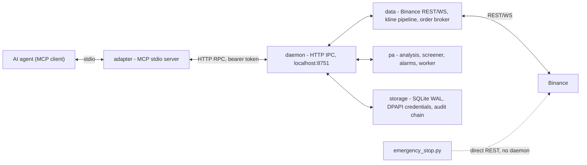

# Rasattrading MCP

A Binance price-action / liquidity-focused Model Context Protocol (MCP) server for AI agents.

A background daemon collects Binance REST/WebSocket data, runs price-action analysis (market
structure, liquidity zones, order blocks), and evaluates screener and alarm logic. A thin MCP
stdio adapter connects to that daemon over local HTTP RPC and exposes the system to AI agents
as tools.

**English | [Turkish](README.tr.md)**


> **Warning:** This system can place and close real-money orders on Binance. Read the
> [Safety and risk](#safety-and-risk) section before use.

## Overview

Rasattrading MCP is a self-hosted, locally run trading system built for agentic use. An AI
agent drives it through standard MCP tools; the system never runs unattended market orders by
default and enforces a paper-first account lifecycle.

- **39 MCP tools** covering market data, price-action analysis, screening, alerts, order
  execution, and account/risk management.
- **Daemon + thin adapter architecture**: a single long-lived daemon owns Binance connections,
  state, and computation; the MCP stdio adapter is a stateless client that forwards calls over
  HTTP RPC on localhost.
- **Paper-first by design**: every account starts locked to paper trading. Real trading is a
  deliberate, one-way, irreversible opt-in per account.

## Features

- **Price-action analysis**: market structure (swings), liquidity zones, order blocks, FVGs,
  VWAP sessions, and chart annotations. Computed only on closed candles, stored as
  immutable, append-only records (`effective_from` / `effective_to` + `algo_version`).
- **Screener**: `scan_market` filters the universe with an allowlisted filter AST
  (`volume_change`, `price_change`, `structure_event`, `liquidity_sweep_occurred`,
  `near_order_block`, `funding_rate`, `oi_change`, `above_below_vwap`) combined with AND/OR
  and sortable by symbol, price change, or volume change — safe against free-form
  SQL/string injection.
- **Alarm engine**: event-driven triggers with deduplication and cooldown; composite alerts
  supported. A triggered alarm can create a `pending_order` awaiting approval.
- **Execution**: idempotent order placement, OCO orders, reconcile-before-retry, and a
  fail-closed risk policy. Alarm-generated order specs follow the approval path:
  `pending_orders` → explicit human approval via `approve_pending_order`. The
  `execute_on_accounts` and `place_order` tools are exceptions: they place orders directly and
  bypass the pending-approval queue. If the account is unlocked for real trading, those tools
  can place real-money orders.
- **Paper / real separation**: each account starts with `trading_lock=paper`.
  `enable_real_trading` is a one-way, irreversible unlock. Accounts with real trading enabled
  cannot be deleted.
- **Emergency stop**: a standalone kill-switch script (`rasattrading-emergency-stop`) that
  works independently of the daemon — it reads stored credentials directly, cancels open
  orders, and liquidates spot balances at market price through Binance REST.
- **Account and risk management**: per-account risk policy, position sizing,
  exposure/balance queries, and an append-only audit hash-chain log.

## Architecture

```
src/rasattrading_mcp/
  config.py, errors.py, envelope.py, tools.py, logging_util.py   # shared
  daemon/    # HTTP IPC server (localhost, bearer token), lock/readiness/handlers
  storage/   # SQLite (WAL), migrations, audit hash-chain, credentials (DPAPI), orders, risk_policy
  data/      # Binance REST/WS client, rate limit, universe, kline pipeline, futures, order broker
  pa/        # price-action chain: swings -> liquidity -> obfvg -> vwap_sessions -> analysis -> screener -> alarms -> worker
  adapter/   # MCP stdio subprocess (talks to the daemon over HTTP RPC)
  emergency_stop.py   # daemon-independent, standalone kill switch
tests/
```



Every tool response uses a common envelope:

```json
{ "ok": true, "data": {}, "meta": { "as_of": "...", "source": "...", "freshness": "...", "algo_version": "..." } }
```

Errors are `{ "ok": false, "error": { "code": "...", "message": "..." } }`.

## Installation

Requirements: **Python 3.11+** on Windows. Credential encryption uses Windows DPAPI; the
`keyring` backend could be ported to other platforms, but development and testing currently
target Windows.

```
python -m venv .venv
.venv\Scripts\pip install -e .[dev]
.venv\Scripts\python -m pytest -q
```

Installed console scripts:

| Script | Purpose |
| --- | --- |
| `rasattrading-mcp` | MCP stdio adapter. Starts/connects the daemon, then serves MCP tools to the agent. |
| `rasattrading-daemon` | Runs the daemon standalone. |
| `rasattrading-emergency-stop` | Standalone emergency kill switch (independent of the daemon). |

## Quick start

1. Install the package as above.
2. Run `rasattrading-mcp`. On first use it starts the daemon as a detached subprocess
   (state under `~/.rasattrading/`, HTTP IPC on `127.0.0.1:8751`, bearer token in
   `~/.rasattrading/daemon.lock`) and waits until it is ready.
3. Point any MCP-capable client at the adapter. The server advertises 39 tools; the daemon
   state is shared, so the daemon can also be run separately with `rasattrading-daemon`.
4. Register an account with `add_account` (API key and secret are encrypted with DPAPI at
   rest). The account starts in **paper** mode.
5. Validate the installation with `ping`, `get_readiness`, and `get_candles`; watch
   `list_accounts` and the audit log (`get_audit_log`) to confirm paper mode before anything
   else.

Order flow: `scan_market` / `create_alert` → trigger → `pending_order` →
`approve_pending_order` (human confirmation) → broker executes. Nothing opens automatically.

## Safety and risk

This project can place and close **real-money orders**. You use it entirely at your own risk.

- Test in paper mode and on a Binance testnet before connecting a live account.
- Start with small capital.
- Verify `rasattrading-emergency-stop` works in your environment before relying on it.
- Real trading is a one-way unlock: re-enabling safety guards after going live is not
  automatic.

Neither the developers nor the contributors are liable for financial losses resulting from the
use of this software. See [LICENSE](LICENSE).

## Contributing

See [CONTRIBUTING.md](CONTRIBUTING.md) for environment setup, coding style, and the pull
request workflow.

## Security

This system handles live exchange credentials and can trade with real money. See
[SECURITY.md](SECURITY.md) for the supported-versions policy and how to report a vulnerability.

## License

MIT — see [LICENSE](LICENSE).
