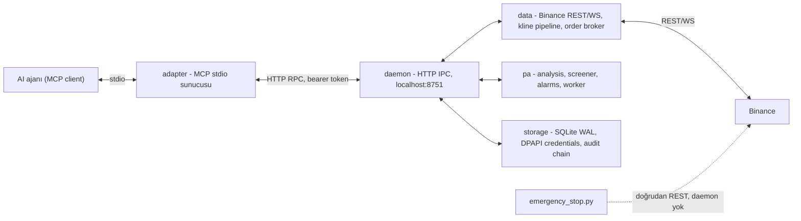

# Rasattrading MCP

AI ajanları için Binance price-action / likidite odaklı bir Model Context Protocol (MCP) sunucusu.

Bir arka plan daemon'ı Binance REST/WebSocket verisini toplar, price-action analizini (piyasa
yapısı, likidite bölgeleri, order block'lar) çalıştırır ve screener/alarm mantığını değerlendirir.
İnce bir MCP stdio adapter, bu daemon'a yerel HTTP RPC ile bağlanıp sistemi AI ajanlarına araç
(tool) olarak sunar.

**[English](README.md) | Türkçe**


> **Uyarı:** Bu sistem Binance'te gerçek parayla emir açıp kapatabilir. Kullanmadan önce
> [Güvenlik ve risk](#güvenlik-ve-risk) bölümünü okuyun.

## Genel bakış

Rasattrading MCP, ajan-tabanlı (agentic) kullanım için tasarlanmış, kendi kendine barındırılan,
yerelde çalışan bir trading sistemidir. Bir AI ajanı sistemi standart MCP araçlarıyla kullanır;
sistem varsayılan olarak hiçbir zaman otomatik emir açmaz ve paper-first bir hesap yaşam
döngüsü uygular.

- **39 MCP aracı**: piyasa verisi, price-action analizi, tarama, alarm, emir icrası ve
  hesap/risk yönetimi.
- **Daemon + ince adapter mimarisi**: uzun ömürlü tek bir daemon Binance bağlantılarının,
  durumun ve hesaplamaların sahibidir; MCP stdio adapter ise localhost üzerinden HTTP RPC ile
  çağrıları ileten durumsuz bir istemcidir.
- **Tasarım gereği paper-first**: her hesap paper trading kilitli başlar. Gerçek trading, hesap
  başına bilinçli, tek yönlü ve geri alınamaz bir tercihtir.

## Özellikler

- **Price-action analizi**: piyasa yapısı (swings), likidite bölgeleri, order block'lar, FVG'ler,
  VWAP session'ları ve grafik annotasyonları. Yalnızca kapanmış mumlar üzerinden hesaplanır;
  immutable, append-only kayıtlar olarak saklanır (`effective_from` / `effective_to` +
  `algo_version`).
- **Screener**: `scan_market` evreni allowlisted bir filtre AST'siyle tarar
  (`volume_change`, `price_change`, `structure_event`, `liquidity_sweep_occurred`,
  `near_order_block`, `funding_rate`, `oi_change`, `above_below_vwap`); filtreler AND/OR ile
  birleştirilebilir ve symbol, price change veya volume change'e göre sıralanabilir —
  serbest SQL/string enjeksiyonuna karşı güvenlidir.
- **Alarm motoru**: deduplikasyon ve cooldown içeren event-driven tetikleyiciler; composite
  alarm desteklenir. Tetiklenen bir alarm onay bekleyen `pending_order` oluşturabilir.
- **Execution**: idempotent emir gönderimi, OCO emirleri, reconcile-before-retry ve fail-closed
  risk politikası. Emirler **asla otomatik açılmaz** — alarmlar ve order spec'leri
  `pending_order` üretir ve açılış için açık insan onayı (`approve_pending_order`) gerekir.
- **Paper/real ayrımı**: her hesap `trading_lock=paper` ile başlar. `enable_real_trading` tek
  yönlü, geri alınamaz bir unlock'tır. Gerçek trading açık olan hesaplar silinemez.
- **Emergency stop**: daemon'dan bağımsız çalışan standalone bir kill-switch script'i
  (`rasattrading-emergency-stop`) — saklanan kimlik bilgilerini doğrudan okur, açık emirleri
  iptal eder ve spot bakiyeleri Binance REST üzerinden market fiyatından satar.
- **Hesap ve risk yönetimi**: hesap başına risk politikası, pozisyon boyutlandırma,
  exposure/bakiye sorguları ve append-only audit hash-chain log'u.

## Mimari

```
src/rasattrading_mcp/
  config.py, errors.py, envelope.py, tools.py, logging_util.py   # ortak
  daemon/    # HTTP IPC sunucusu (localhost, bearer token), lock/readiness/handlers
  storage/   # SQLite (WAL), migrations, audit hash-chain, credentials (DPAPI), orders, risk_policy
  data/      # Binance REST/WS client, rate limit, universe, kline pipeline, futures, order broker
  pa/        # price-action zinciri: swings -> liquidity -> obfvg -> vwap_sessions -> analysis -> screener -> alarms -> worker
  adapter/   # MCP stdio subprocess (daemon'a HTTP RPC ile bağlanır)
  emergency_stop.py   # daemon'dan bağımsız, standalone kill switch script'i
tests/
```



Her tool cevabı ortak bir envelope kullanır:

```json
{ "ok": true, "data": {}, "meta": { "as_of": "...", "source": "...", "freshness": "...", "algo_version": "..." } }
```

Hatalar `{ "ok": false, "error": { "code": "...", "message": "..." } }` biçimindedir.

## Kurulum

Gereksinimler: Windows'ta **Python 3.11+**. Kimlik bilgisi şifrelemesi Windows DPAPI kullanır;
`keyring` arka ucu başka platformlara taşınabilir ancak geliştirme ve test şu an Windows hedeflidir.

```
python -m venv .venv
.venv\Scripts\pip install -e .[dev]
.venv\Scripts\python -m pytest -q
```

Kurulan konsol script'leri:

| Script | Amaç |
| --- | --- |
| `rasattrading-mcp` | MCP stdio adapter. Daemon'ı başlatır/bağlanır, ardından MCP araçlarını ajana sunar. |
| `rasattrading-daemon` | Daemon'ı standalone çalıştırır. |
| `rasattrading-emergency-stop` | Standalone acil durdurma kill switch'i (daemon'dan bağımsız). |

## Hızlı başlangıç

1. Paketi yukarıdaki gibi kurun.
2. `rasattrading-mcp` çalıştırın. İlk kullanımda daemon'ı detached bir süreç olarak başlatır
   (durum `~/.rasattrading/` altında, HTTP IPC `127.0.0.1:8751`'de, bearer token
   `~/.rasattrading/daemon.lock`'ta) ve hazır olana kadar bekler.
3. Herhangi bir MCP uyumlu istemciyi adapter'a bağlayın. Sunucu 39 araç bildirir; daemon durumu
   paylaşıldığı için daemon ayrıca `rasattrading-daemon` ile de çalıştırılabilir.
4. `add_account` ile bir hesap kaydedin (API key ve secret, diskte DPAPI ile şifrelenir). Hesap
   **paper** modda başlar.
5. Kurulumu `ping`, `get_readiness` ve `get_candles` ile doğrulayın; başka bir şey yapmadan
   önce `list_accounts` ve audit log (`get_audit_log`) ile paper modda olduğunu teyit edin.

Emir akışı: `scan_market` / `create_alert` → tetik → `pending_order` →
`approve_pending_order` (insan onayı) → broker icra eder. Hiçbir şey otomatik açılmaz.

## Güvenlik ve risk

Bu proje **gerçek parayla emir** açıp kapatabilir. Tamamen kendi sorumluluğunuzdadır.

- Canlı bir hesaba bağlamadan önce paper modda ve Binance testnet'inde test edin.
- Küçük sermayeyle başlayın.
- Kullanmadan önce `rasattrading-emergency-stop`'un kendi ortamınızda çalıştığından emin olun.
- Gerçek trading tek yönlü bir unlock'tır: canlıya geçtikten sonra güvenlik kilitlerini yeniden
  etkinleştirmek otomatik değildir.

Geliştiriciler ve katkıda bulunanlar, bu yazılımın kullanımından doğacak finansal kayıplardan
sorumlu değildir. Bkz. [LICENSE](LICENSE).

## Katkıda bulunma

Ortam kurulumu, kod stili ve pull request akışı için [CONTRIBUTING.tr.md](CONTRIBUTING.tr.md)'ye
bakın.

## Güvenlik

Bu sistem canlı borsa kimlik bilgilerini işler ve gerçek parayla işlem yapabilir. Desteklenen
sürüm politikası ve güvenlik açığı bildirimi için [SECURITY.tr.md](SECURITY.tr.md)'ye bakın.

## Lisans

MIT — bkz. [LICENSE](LICENSE).
